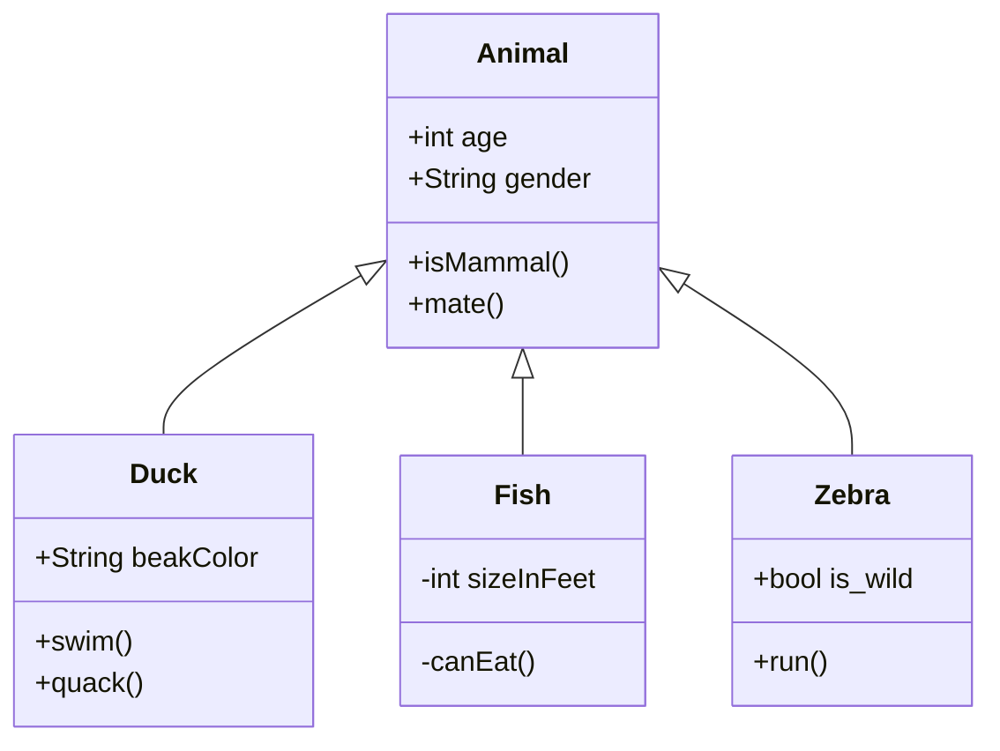

This part of code enables the game when window is loaded completely and DOM manipulation is available.
<!-- NOTE-swimm-snippet: the lines below link your snippet to Swimm -->
### 📄 index.html
```html
12     <script type="text/javascript">
13     window.onload = function()
14     {
15     	var game = new ChainReaction(
16     		30,
17     		6
18     	);
19     
20     	game.setColors(['red','green']);
21     	game.loadGame();
22     	game.clickable = true;
23     };
```

<br/>

# Sampling out the code

<br/>

|<br/>|<br/>|
|-----|-----|
|<br/>|<br/>|

<br/>

<!--MERMAID {width:100}-->

<!--MCONTENT {content: "classDiagram<br/>\nAnimal <|-- Duck<br/>\nAnimal <|-- Fish<br/>\nAnimal <|-- Zebra<br/>\nAnimal : +int age<br/>\nAnimal : +String gender<br/>\nAnimal: +isMammal()<br/>\nAnimal: +mate()<br/>\nclass Duck{<br/>\n+String beakColor<br/>\n+swim()<br/>\n+quack()<br/>\n}<br/>\nclass Fish{<br/>\n\\-int sizeInFeet<br/>\n\\-canEat()<br/>\n}<br/>\nclass Zebra{<br/>\n+bool is\\_wild<br/>\n+run()<br/>\n}<br/>\n\n<br/>"} --->

<br/>

[[sym-mention:(daf1e6b7-e83c-4493-b221-b48833e64fc5|nO5LX)Mayank Mishra]]

<br/>

<br/>

<div align="center"></div>

<br/>

This file was generated by Swimm. [Click here to view it in the app](https://app.swimm.io/repos/Z2l0aHViJTNBJTNBQXRvbW9zJTNBJTNBbWF5YW5r/docs/sdzsh7lh).
